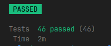
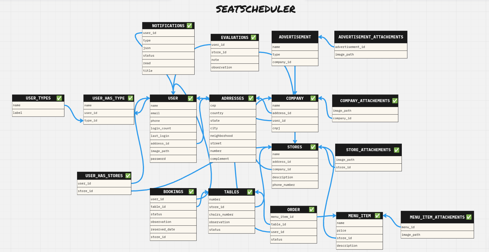

# Seat Scheduler API

**Seat Scheduler API** é a API que alimenta o sistema de reservas de mesas para restaurantes. Foi desenvolvida utilizando **AdonisJS** e **TypeScript**, oferecendo endpoints para o gerenciamento de empresas, lojas, mesas e reservas. Inclui validações robustas utilizando **Vine**, testes automatizados com **Japa** e Banco de dados **PostgreSQL**.

## Tecnologias Utilizadas
- **AdonisJS** - Framework Node.js MVC para construção de APIs eficientes.
- **TypeScript** - Tipagem estática para maior segurança no código.
- **Vine** - Validações flexíveis e seguras.
- **Japa** - Framework de testes para garantir a qualidade da API.
- **PostgreSQL** - Banco de dados relacional de alta performance.

## Funcionalidades
- Autenticação JWT para segurança das rotas.
- Gerenciamento de empresas, lojas e mesas.
- Criação, listagem e cancelamento de reservas.
- Validação de dados com Vine.
- Testes automatizados para validação das rotas e lógica de negócios.

## Testes Automatizados
Os testes são escritos com **Japa**, garantindo a funcionalidade e integridade da API. Para rodar os testes:

```bash
node ace test
```



Os testes cobrem:
- Autenticação.
- Operações de CRUD para empresas, lojas e mesas.
- Criação e cancelamento de reservas.

## Banco de dados
Estrutura do banco de dados e relacionamentos foi montada no MIRO.



## Postman

https://www.postman.com/caiosouza-team/seatscheduler/collection/kpbgzwe/seatscheduler